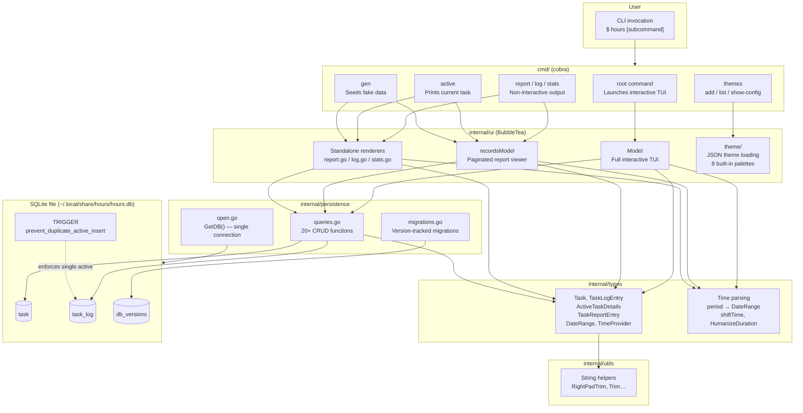
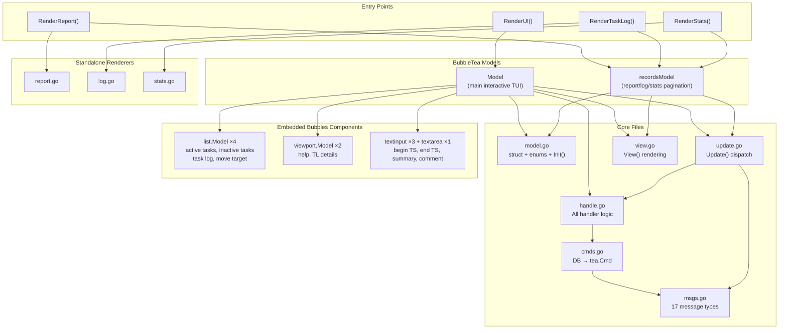
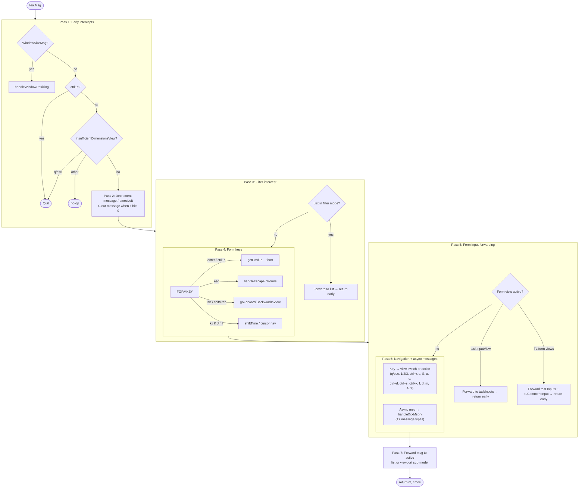
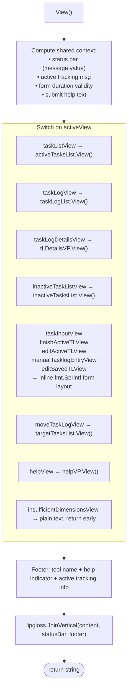
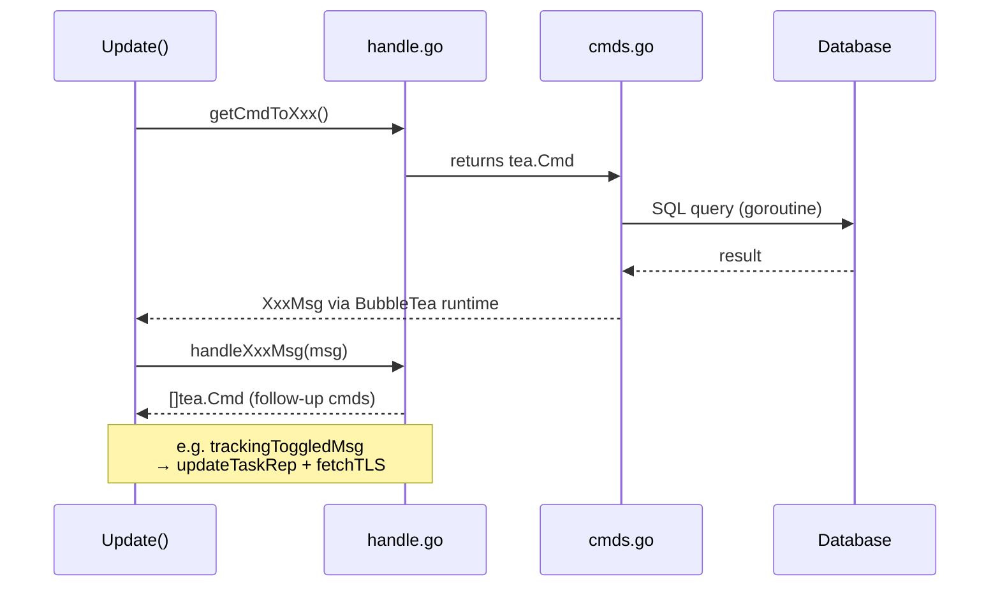
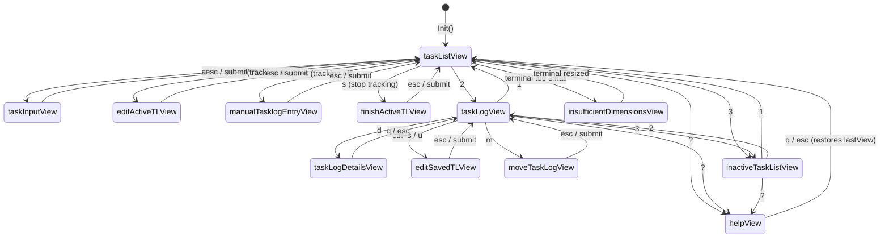

# Architecture

## 1. Full Application

The application is a single Go binary with two modes: an **interactive TUI** (default) and **non-interactive CLI subcommands** (`report`, `log`, `stats`, `active`). All data is persisted in a local SQLite file.

### Package Dependency Tree

```
main → cmd → ui → persistence → types → utils
                → types
             → common
             → ui/theme
```

No circular dependencies. `utils` and `common` are leaves with no internal deps.

### Database Schema

Three tables in SQLite (`modernc.org/sqlite`, pure-Go driver):

| Table | Key Columns | Notes |
|---|---|---|
| `task` | `id`, `summary`, `secs_spent`, `active` | `secs_spent` is a **denormalized total** kept in sync on every write |
| `task_log` | `id`, `task_id`, `begin_ts`, `end_ts`, `secs_spent`, `comment`, `active` | `end_ts` is NULL while a session is open; `active=1` means currently tracking |
| `db_versions` | `id`, `version`, `created_at` | Append-only migration log |

A DB trigger (`prevent_duplicate_active_insert`) enforces that only **one** `task_log` row can have `active=1` at any time.

### Diagram



---

# UI Architecture

The `internal/ui` package implements two BubbleTea models:

- **`Model`** — the main interactive TUI launched by `RenderUI()`
- **`recordsModel`** — a lightweight pagination shell for the non-interactive `report`/`log`/`stats` subcommands

## File Overview

| File | Purpose |
|---|---|
| `model.go` | `Model` struct, all enums/types, `Init()` |
| `initial.go` | `InitialModel()`, `initialRecordsModel()` constructors |
| `msgs.go` | All 17 `tea.Msg` types |
| `cmds.go` | DB → `tea.Cmd` factories |
| `handle.go` | All handler & `getCmdTo…` methods (966 lines) |
| `update.go` | `Update()` dispatch only (508 lines) |
| `view.go` | `View()` rendering only (404 lines) |
| `styles.go` | `Style` struct, `NewStyle()` |
| `help.go` | `getHelpText()` |
| `report.go` / `log.go` / `stats.go` | Standalone table renderers |
| `theme/` | `Theme` struct + 8 built-in palettes |

**Naming conventions in `handle.go`:**
- `getCmdTo…` — validates input, returns a `tea.Cmd` (issues a DB command)
- `handleRequest…` / `handle…` — mutates model state, no DB interaction

---

## Diagrams

### 2. UI Package Architecture



---

### 3. Update Dispatch (7 Passes)



---

### 4. View Rendering



---

### 5. Async Command / Message Cycle



---

### 6. View State Transitions


